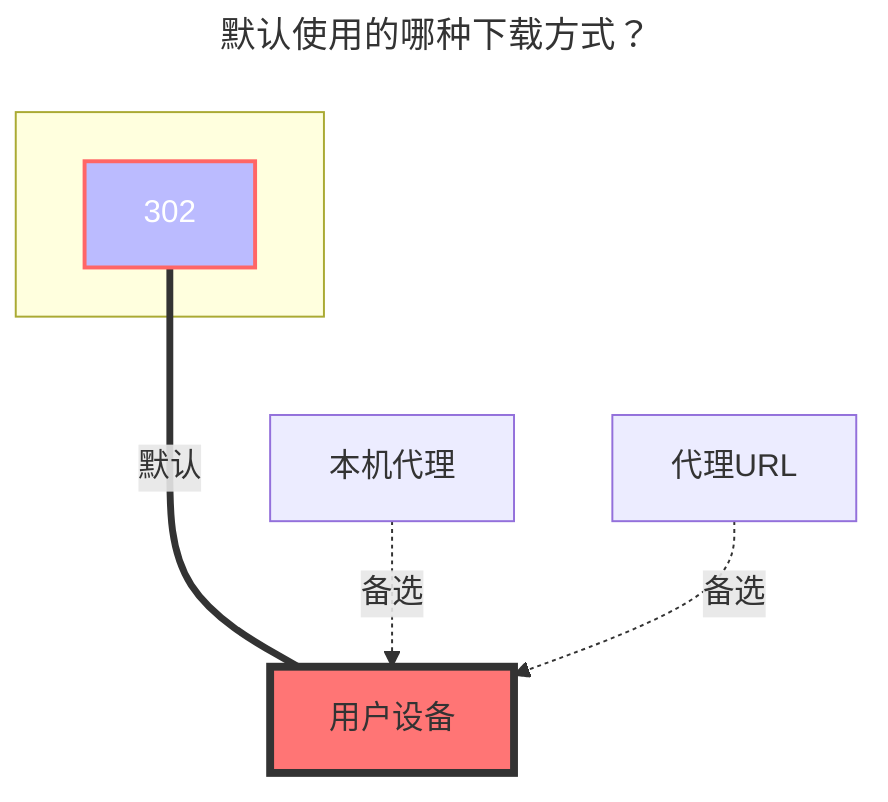

---
# This is the icon of the page
icon: iconfont icon-state
# This control sidebar order
order: 16
# A page can have multiple categories
category:
  - Guide
# A page can have multiple tags
tag:
  - Storage
  - Guide
  - "302"
# this page is sticky in article list
sticky: true
# this page will appear in starred articles
star: true
---

# PikPak/分享

## **PikPak挂载**

### **用户名**

邮件地址或者电话号码？

### **密码**

密码

 

### **根文件夹ID**

可以通过 https://mypikpak.com/ 获取，默认为 `root`。

 

### **禁用媒体链接**

- **https://github.com/alist-org/alist/issues/4735**

  

## **PikPak分享挂载**

::: warning
~~截止 **2023年2月4日** 挂载分享已被官方河蟹，目前只可以看前4分钟，后续还能不能用等待即可~~ 

~~**v3.12.0修复,这次能活多久未知（20240522）**~~

已知目前pikpak分享只能看40%-50% **（v3.35.0）**

:::

只需要填写  `用户名` ，`密码`，`分享ID` 三项即可 ，**根文件夹ID** 可写可不写，不写默认为root目录（根目录）

- 根文件夹ID：如果是多层目录，你想让哪个目录展示当根目录你就写哪个根目录.
- 分享密码：分享的有密码就写，没有就不写

 

### **批量添加PikPak分享挂载**

使用的软件：**https://github.com/yzbtdiy/alist_batch**

<BiliBili bvid="BV1Ps4y1U7Zu" ratio="16:9" low-quality no-danmaku />

 

## **注意事项**

**Q**：添加存储时提示：**Failed init storage: invalid_account_or_password** 怎么办，我输入的密码的对的

**A**：如果不是账号密码填错，可能是注册的时候使用了Google，FB等第三方快捷注册，虽然看起来账号是谷歌邮箱，但实际上是不能用邮箱登入，而必须使用第三方验证，**Alist** 现在还不支持这种跳转到第三方的验证，**所以你要在账号设置里绑定一个邮箱同时设置一下登录密码**，或者重新注册一个新账号

-----

**Q**：添加挂载时提示：**failed get objs: failed to list objs: Sorry, sharing is not available in the current region**

**A**：因为在国内^PikPak^是禁止访问的，给`AList`使用代理即可，如何让`AList`使用代理[**参考方案之一,此方法仅限于Windows搭建**](https://anwen-anyi.github.io/index/07-wenti.html#_41-alist%E5%A6%82%E4%BD%95-%E4%BD%BF%E7%94%A8-%E5%90%83%E5%88%B0-%E4%BB%A3%E7%90%86-proxy)

 

### **默认使用的下载方式**

