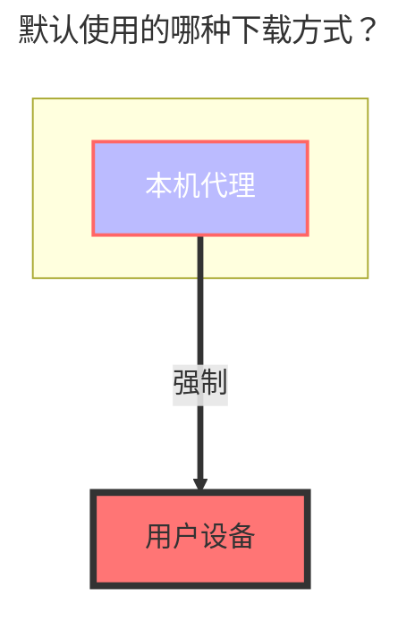

---
# This is the icon of the page
icon: iconfont icon-state
# This control sidebar order
order: 18
# A page can have multiple categories
category:
  - Guide
# A page can have multiple tags
tag:
  - Storage
  - Guide
# this page is sticky in article list
sticky: true
# this page will appear in starred articles
star: true
---

# 夸克网盘

:::danger
由于夸克网盘限速问题，夸克网盘现在只能使用本地代理进行传输，[说明详见](https://github.com/alist-org/alist/issues/4318#issuecomment-1536214188)
:::

## **Cookie 和 根文件夹ID**

从请求中获取 Cookie 和根文件夹 ID：
方法：按F12打开“调试”，选中“网络”，找到一个以“sort”开头的文件即可找到

或者根目录id也可以从地址栏获取（根目录为0）：

### **默认使用的下载方式**

说明：[**alist/issues/4318**](https://github.com/alist-org/alist/issues/4318#issuecomment-1536214188)
