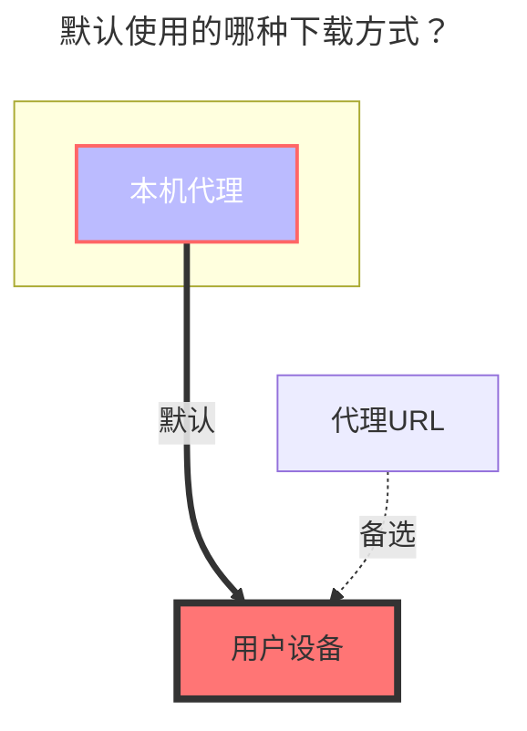

---
# This is the icon of the page
icon: iconfont icon-state
# This control sidebar order
order: 16
# A page can have multiple categories
category:
  - Guide
# A page can have multiple tags
tag:
  - Storage
  - Guide
  - "本地代理"
# this page is sticky in article list
sticky: true
# this page will appear in starred articles
star: true
---

# 曲奇云盘

曲奇云盘官网：https://quqi.com ( v3.31.0)

 

### **手机号、密码**

登录手机号和密码，建议使用 [Cookie](#cookie)方式登录

 

### **Cookie**

使用Cookie登录 **可保持多终端同时在线使用**，如果使用 `手机号、密码`进行挂载会顶掉其它终端登录状态

- 获取方式：随意在`F12`网络请求中找到一个携带`Cookie`参数的进行复制即可

 

### **根文件夹ID**

根文件夹ID为 `0`，其它子文件夹ID参考下图

 

### **CDN**

提升VIP用户单连接下载速度，解决非VIP用户下载连接数限制问题，**CDN内容需要解密，会占用一些计算资源**

 

### **默认使用的下载方式**

