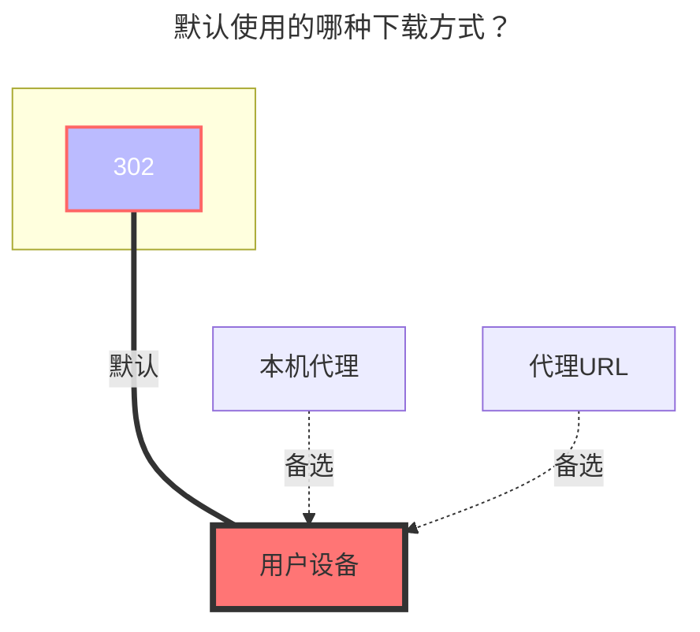

---
# This is the icon of the page
icon: iconfont icon-state
# This control sidebar order
order: 20
# A page can have multiple categories
category:
  - Guide
# A page can have multiple tags
tag:
  - Storage
  - Guide
  - "302"
# this page is sticky in article list
sticky: true
# this page will appear in starred articles
star: true
---

# 对象存储

S3 对象存储协议，如 COS、OSS、B2。

## **存储桶**

存储桶名

## **Endpoint**

Endpoint address（不知道可以看下方的官方文档）

## **Region**

地区（不知道可以看下方的官方文档）

## **Access key id**

Access key id

## **Secret access key**

Secret access key

## **Session token**

会话令牌，三段式token需要使用，正常是两段式不需要填写

## **Root folder path**

根路径，不填则默认为根目录。

## **Custom Host**

自定义 CDN 加速域名

## **Sign url expire**

签名下载地址的有效期默认为 4 小时。 如果使用自定义加速域名，该选项无效。

## **Placeholder**

占位符文件的名称。

## **Force path style**

是否启用 `ForcePathStyle`，通常是 minio 需要的。

## **List object version**

参见 S3 的 SDK 文档。


## **添加对象存储示例及官方文档**

`对象存储`包含但不限于只有这些，还有很多例如微软谷歌没有添加，这里没有示例是因为注册开通困难无法提供示例教程，如果您有帐号欢迎联系提供帐号我来添加

::::tabs#S3

@tab 阿里云

[**阿里云OSS官网**](https://oss.console.aliyun.com/)

[**公共云下OSS各地域Endpoint对照表**](https://help.aliyun.com/document_detail/31837.html)

::: tip
Alist挂载**阿里云盘**需要跳过 `referer` ，若你在防盗链开启不允许 `referer` 为空的话会无法使用，因为阿里云盘用的就是阿里云OSS（北京地区的）

其实 `地区|Region` 选项写 `Endpoint` 一样的也可以用，但是为了规范还是照着对照表写吧。

:::


填写示例：


@tab 腾讯云

[**腾讯云COS官网**](https://console.cloud.tencent.com/cos)

[**公共云下COS各地域Endpoint对照表**](https://cloud.tencent.com/document/product/436/6224)

填写示例：


@tab 天翼云

[**天翼云OOS官网**](https://oos-cn.ctyun.cn/oos/ctyun/consoleBucket.html)

[**公共云下OOS各地域Endpoint对照表**](https://www.ctyun.cn/document/10026693/10027878)

填写示例：


@tab 百度云

[**百度云BOS官网**](https://console.bce.baidu.com/bos)

[**自行配置Bucket的Referer白名单权限**](https://cloud.baidu.com/doc/BOS/s/Bk6kqu8eq#设置referer白名单)

[**公共云下BOS各地域Region和Endpoint对照表**](https://cloud.baidu.com/doc/BOS/s/akrqd2wcx)

**兼容AWS S3的Endpoint对照表**[**点击查看具体**](https://cloud.baidu.com/doc/BOS/s/xjwvyq9l4)

填写示例：


@tab 七牛云

[**七牛云Kodo官网**](https://portal.qiniu.com/kodo/bucket)

[**公共云下Kodo各地域Region和Endpoint对照表**](https://developer.qiniu.com/kodo/4088/s3-access-domainname)

填写示例：


@tab 华为云

[**华为云OBS官网**](https://console.huaweicloud.com/console/#/obs/manager/buckets)

[**公共云下OBS各地域Region和Endpoint对照表自行查看**](https://developer.huaweicloud.com/endpoint?OBS)对应的

秘钥AK/SK[获取](https://console.huaweicloud.com/iam/?region=cn-north-4&locale=zh-cn#/mine/accessKey)自行设置

填写示例：


@tab 京东云

[**京东云OSS官网**](https://www.jdcloud.com/cn/products/object-storage-service)

优点：[免费10G](https://www.jdcloud.com/cn/activity/oss)，支持IPV6
缺点：需要预充值100元才能开通，不推荐尝试，但是预存开通对象存储后提现依旧可以用。

[**公共云下OSS各地域Region和Endpoint对照表**](https://docs.jdcloud.com/cn/object-storage-service/oss-endpont-list)

填写示例：


@tab 多吉云

[**多吉云OSS官网**](https://www.dogecloud.com/product/oss)，如果要添加多吉云，请使用单独的`多吉云`驱动添加，请勿使用`对象存储`驱动

地区代码：

```json
// 0: 上海（华东），1: 北京（华北），2: 广州（华南），3: 成都（西南）
```


@tab 移动云

[**移动云EOS官网**](https://console.ecloud.10086.cn/api/page/eos-console-web/CIDC-RP-00/eos/bucket?productType=os&v=new)

需要预充值100元才能开通，不推荐用。

[**公共云下OSS各地域Region和Endpoint对照表**](https://ecloud.10086.cn/op-help-center/doc/article/48082)

填写示例：


@tab 又拍云

[**又拍云USS官网**](https://console.upyun.com/services/file/)：[点击这里进行配置USS](./uss.md)

@tab 亚马逊

[**亚马逊S3官网**](https://s3.console.aws.amazon.com/s3/)

端点 URL 包含存储桶所在的区域名称

例^1^，如果您的存储桶位于美国东部（俄亥俄）区域

> 则 Endpoint (终端节点) URL 的格式为  **`s3.us-east-2.amazonaws.com/your-bucket-name`**
>
> Region (地区)参数：**`us-east-2`**
>
> 存储桶名称：**`your-bucket-name`**（你自己的存储桶名称）

例^2^，我的的存储桶是`东京`的，存储桶名字叫 `cdn-aw`，那么完整的参数填写就是如下

>1. **Endpoint** ：s3.ap-northeast-1.amazonaws.com
>2. **地区**：ap-northeast-1
>3. **存储桶名称**：cdn-aw

下面我们看一下完整的参数填写示例吧

填写示例


@tab R2

[**cloudflare R2官网**](https://dash.cloudflare.com/)

**Endpoint** ：S3 端点可通过 **`https://<ACCOUNT_ID>.r2.cloudflarestorage.com`** 端点使用

**`ACCOUNT_ID`** 就是你的账号ID，随处可见例如顶部地址栏链接后面的ID就是你账号ID

填写示例：


@tab B2

[**B2官网**](https://secure.backblaze.com/b2_buckets.htm)

国外的，全称 **`Backblaze`**，不需要验证信息，说是前10G免费。

填写示例：


@tab Scaleway

[**scaleway官网**](https://console.scaleway.com/object-storage/buckets)

国外的，需要卡验证信息

[**公共云下Scaleway各地域Region和Endpoint对照表**](https://www.scaleway.com/en/docs/storage/object/concepts/#object-storage)

填写示例：


@tab Mini-io

使用`Minio`自建对象存储的应该都知道，ID和秘钥如何获取，这里就不说了

只需要填写存储桶名称，访问秘钥ID，安全访问秘钥，Endpoint 这四个选项，地区空着即可

**Endpoint：http(s):\//《YOUR_IP/URL》:9001/**，可以使用IP也可以使用域名

最后记得打开 **`强制路径样式`** 才能使用，否则无法使用[点击查看详情](https://github.com/alist-org/alist/discussions/4920#discussioncomment-6635452)

填写示例：


@tab Google Cloud

默认你已经有Google Cloud的账号了，那么我们直接进入 Google Cloud Storage的设置页面，这个[链接直达](https://console.cloud.google.com/storage/settings;tab=interoperability)

然后会进入下面这个页面


在这个页面我们可以很明显的看到 Endpoint 和 Access Key，我这里因为已经创建的有一个AK/SK了，如果你没有，直接点下面的创建即可，点了创建，会提示你执行账户，我这因为账号问题，有两个，正常情况下只有一个，你选了账户后，点创建


然后就会出现Access Key/Secret 了，它俩分别对应Alist的 访问密钥 Id 和 安全访问密钥，这个只显示一次，一定要复制并保存到本地


到这里，Alist所需要的 EndPoint 、访问密钥 Id、安全访问密钥 就获取到了，剩余的 存储桶和地区，请在存储桶里面查看


::::


### **默认使用的下载方式**


