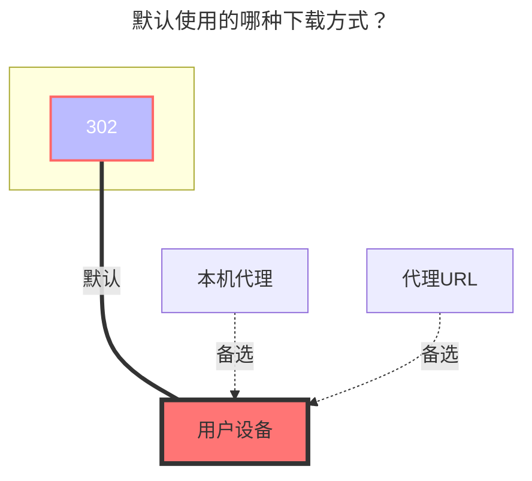

---
# This is the icon of the page
icon: iconfont icon-state
# This control sidebar order
order: 23
# A page can have multiple categories
category:
  - Guide
# A page can have multiple tags
tag:
  - Storage
  - Guide
  - "302"
# this page is sticky in article list
sticky: true
# this page will appear in starred articles
star: true
---

# Teambition

Teambition 工程文件，支持中国服务器和国际服务器。

## **Cookies**

登录后获取，有效期未知

## **项目 ID 和根文件夹 ID**

登录后从网址获取

### **默认使用的下载方式**

