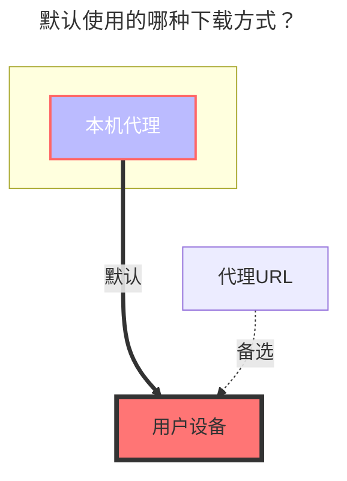
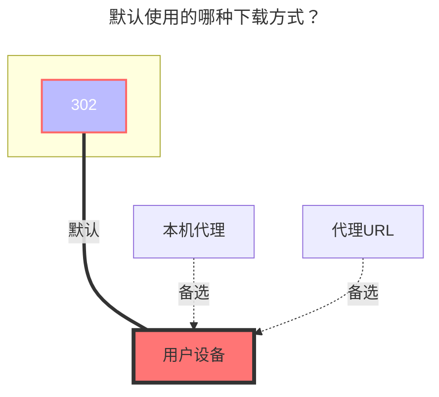

---
# This is the icon of the page
icon: iconfont icon-state
# This control sidebar order
order: 17
# A page can have multiple categories
category:
  - Guide
# A page can have multiple tags
tag:
  - Storage
  - Guide
  - "本地代理"
  - "302"
# this page is sticky in article list
sticky: true
# this page will appear in starred articles
star: true
---

# 迅雷云盘/X/浏览器

:::tip

迅雷 前两个是服务国内用户

小白请直接使用 迅雷不要使用 `迅雷专家版`

`迅雷专家版`主要提供更自由的设置,实现更多登录方式

-----

迅雷 X 服务海外用户，截止文档发布时只有 安卓版其它版本暂未发布

- 迅雷 X 目前未开启会员的速度也符合使用情况，后期更改暂时未知
- 使用APP可能需要 Proxy，挂载在AList不需要

-----

迅雷浏览器：目前仅支持手机端（Android、iOS）

- **https://x.xunlei.com/**
- 如果在AList登录后会将手机端踢下线，反之如果先在AList登录再登录手机，会将AList踢下线但是没有提示

:::


:::: tabs#thunder

@tab 迅雷

### **用户名**

即用于登陆的手机号,邮箱,用户名(有概率无法登录,需要尝试)

1. 在获取验证码之前填写手机号先不要携带 `+86` 区号
2. 获取验证码后填写需要携带 `+86` 区号，例如 +8613722223333 这样填写

<br/>


### **密码**

即用于登陆的密码

<br/>


### **CaptchaToken**

在登录或上传是可能出现 need verify: {url},请访问错误中的链接完成验证得到 CaptchaToken（验证码）


填写好挂载目录 ID 账号 密码后保存，右上角会出现一大坨(没法复制)，

我们回到添加账号这里来复制 从 Https 开始复制到结束到一个新窗口进行获取验证码参数(CaptchaToken)

看下图添加


<br/>


### **默认使用的下载方式**




@tab 迅雷专家版

:::tip
迅雷如果需要下载必须指定 UserAgent(同下 DownUserAgent)
或使用本程序中的代理功能进行中转。
:::

### **登录类型**

1. 选择 `用户名` 时填用户名和密码
   - 用户名需要携带 `+86` 区号，例如 +8613722223333 这样填写


2. 选择 `刷新令牌`时只需填写 `刷新令牌`

<br/>


### **签名类型**

选择 `算法` 时需填写 `算法`(比较难获取,需要逆向)

选择 `验证码签名` 时只需填写 `验证码签名` 和 `时间戳`

```
//签名算法
str = ClientID + ClientVersion + PackageName + DeviceID + Timestamp
for (Algorithm in Algorithms) {
    str = md5(str + Algorithm)
}
CaptchaSign = "1." + str
```

登录类型(Login type) 和 签名类型(Sign type) 推荐选择选项


<br/>


### **设备ID**

通过 MD5 计算的值，用于判断登录的设备

### **客户端ID, 客户端秘钥, 客户端版本, 包名**

与签名有关，根据实际情况填写

### **用户代理**

API 请求使用的 UserAgent，设置错误可能无法访问或限速

### **下载用户代理**

下载时用到的 User Agent，如果设置错误会无法下载(开启代理会使用) 固定参数：

`Mozilla/5.0 (Windows NT 10.0; Win64; x64) AppleWebKit/537.36 (KHTML, like Gecko) Chrome/67.0.3396.99 Safari/537.36`

<br/>


## **关键数据获取流程**

通过网络分析工具(抓包工具)获取迅雷请求数据

打开迅雷并登录账号（下图使用的是 PC 客户端来操作的，Web 端也可以）

请求 https://xluser-ssl.xunlei.com/v1/shield/captcha/init 中包含
CaptchaSign、Timestamp、DeviceID、ClientID、ClientVersion、PackageName、User-Agent

注：获取好两张图信息后再慢慢的从抓到的两条数据内挑选数据填进去

登录迅雷 打开抓包工具后，这时候可能，不能立马获取到 `v1/shield/captcha/init` 的信息，

迅雷 PC 客户端 和抓包工具不要关闭，等待即可，**5 分钟左右** 就会自动刷新

就会看到如下图的参数 照着获取填写即可(看不清的话可以右键复制图片链接到浏览器新开个窗口打开)

看到 `v1/shield/captcha/init` 抓取到后 请**立刻马上不要耽误一秒钟** 把迅雷在右下角任务栏的迅雷右键点击退出，彻底退出 然后重新打开 获取到**图二**


重启迅雷会刷新 token

请求 https://xluser-ssl.xunlei.com/v1/auth/token 中包含 RefreshToken（请使用返回的值）、ClientSecret（web 端不存在）


图一包含 **7 条** 参数 | 图一包含 **2 条** 参数 | 一条固定参数(Down UserAgent) ，十条参数 和 3 个选项 以及一个挂载路径，写好保存即可，保存前记得检查喔~~

<br/>


### **使用视频URL**

- **https://github.com/alist-org/alist/pull/6464#issuecomment-2124306443**

<br/>


### **迅雷专家版 完整的参数填演示图**


<br/>


### **默认使用的下载方式**



@tab 迅雷 X

::: danger

目前官方对于频繁调用接口行为会进行封号处理，请谨慎使用，后果自负。

:::

### **用户名、密码**

即用于登陆的邮箱和密码

<br/>


### **验证码**

会自动填充，不用自己填写

<br/>


### **根文件夹ID**

默认为空展示全部目录，如果想用子文件夹做根目录请抓包获取

- 抓包请求中的`https://api-pan.xunleix.com/drive/v1/files?parent_id=&page_token=&filters=`，可以得到下面参数
  - `文件夹ID（id）`
  - `文件夹名称（name）`
  - `父文件夹ID（parent_id）`
- 根目录下获取的`文件夹ID（Folder id）`（例如：`我接收的文件`、`我的云盘`、`高速云下载`），**这个会随着账号不同而变动，没有通用的值，自己抓包获取**


<br/>


### **使用视频URL**

- **https://github.com/alist-org/alist/pull/6464#issuecomment-2124306443**

<br/>


### **默认使用的下载方式**


@tab 迅雷 X 专家版

::: danger

目前官方对于频繁调用接口行为会进行封号处理，请谨慎使用，后果自负。

:::

### **用户名、密码**

即用于登陆的邮箱和密码

<br/>


### **验证码**

会自动填充，不用自己填写

<br/>


### **根文件夹ID**

默认为空展示全部目录，如果想用子文件夹做根目录请抓包获取

- 抓包请求中的`https://api-pan.xunleix.com/drive/v1/files?parent_id=&page_token=&filters=`，可以得到下面参数
  - `文件夹ID（id）`
  - `文件夹名称（name）`
  - `父文件夹ID（parent_id）`
- 根目录下获取的`文件夹ID（Folder id）`（例如：`我接收的文件`、`我的云盘`、`高速云下载`），**这个会随着账号不同而变动，没有固定一样的值，自己抓包获取**


<br/>


### **登录类型**

- `用户`：选择 `用户`时填`用户名和密码`
- `刷新令牌`：选择 `刷新令牌` 时只需填写 `刷新令牌`

<br/>


### **签名类型**

- `算法`：选择 `算法（Algorithms）` 时需填写 `算法（Algorithms）`
- `验证码签名`：选择 `验证码签名（Captcha sign）` 时只需填写 `验证码签名（Captcha sign）` 和 `时间戳（Timestamp）`

<br/>


### **部分参数抓包说明**

- `验证码` ：无需填写
- `设备id`：通过 MD5 计算的值，用于判断登录的设备
- `客户端ID`, `客户端密钥`, `客户端版本`, `包名`：与签名有关，根据实际情况填写

-----

- `用户代理`：API 请求使用的 `用户代理`，设置错误可能无法访问或限速
- `下载用户代理`：下载时用到的 `用户代理`，如果设置错误会无法下载(开启代理会使用) 
  - `用户代理` 和 `下载用户代理` 可以自己填写，如果不知道如何填写可以留空会自动填充

-----

抓包请求中的`https://xluser-ssl.xunleix.com/v1/shield/captcha/init`，可以得到下面参数^6个^

- `客户端ID（Client id）`、`设备id（Device id）`、`验证码签名（Captcha sign）`
- `包名（Package name）`、`客户端版本（Client version）`、`时间戳（Timestamp）`


抓包请求中的`https://xluser-ssl.xunleix.com/v1/auth/signin`，可以得到下面的参数^2个^

  - `客户端ID（Client id）`、`客户端密钥（Client secret）`


<br/>


### **使用视频URL**

- **https://github.com/alist-org/alist/pull/6464#issuecomment-2124306443**

<br/>


### **默认使用的下载方式**


@tab 迅雷浏览器

### **用户名、密码**

即用于登陆的手机号,邮箱,用户名，以及密码

- 填写手机号要携带 `+86` 区号，例如 `+8613822334455`

<br/>


### **验证码**

会自动填充，不用自己填写

<br/>


### **根文件夹ID**

默认为空展示全部目录，如果想用子文件夹做根目录请抓包获取

- 抓包请求中的`https://x-api-pan.xunlei.com/drive/v1/files?parent_id&page_token&space=`，可以得到下面参数
  - `文件夹ID（id）`
  - `文件夹名称（name）`
  - `父文件夹ID（parent_id）`
- 根目录下获取的`文件夹ID（Folder id）`（例如：`来自分享`、`超级保险箱`），**这个会随着账号不同而变动，没有固定一样的值，自己抓包获取**


<br/>


### **保险箱密码**

迅雷浏览器云盘的保险箱密码

- 超级保险箱內文件只能直接删除 无法删除到回收站，所以下方[**删除方式**](#删除方式)与此配置无关

<br/>


### **删除方式**

**回收站**：在AList删除后移除到回收站，如果有误删可以通过迅雷云盘恢复

**删除**：直接删除不可以恢复找回

<br/>


### **使用视频URL**

- 开启 `视频视频URL` 可能会遇到部分类型的文件无法正常访问
- **https://github.com/alist-org/alist/pull/6464#issuecomment-2124306443**

<br/>


### **默认使用的下载方式**


@tab 迅雷浏览器专家版

### **用户名、密码**

即用于登陆的手机号,邮箱,用户名，以及密码

- 填写手机号要携带 `+86` 区号，例如 `+8613822334455`

<br/>


### **验证码**

会自动填充，不用自己填写

<br/>


### **根文件夹ID**

默认为空展示全部目录，如果想用子文件夹做根目录请抓包获取

- 抓包请求中的`https://x-api-pan.xunlei.com/drive/v1/files?parent_id&page_token&space=`，可以得到下面参数
  - `文件夹ID（id）`
  - `文件夹名称（name）`
  - `父文件夹ID（parent_id）`
- 根目录下获取的`文件夹ID（Folder id）`（例如：`来自分享`、`超级保险箱`），**这个会随着账号不同而变动，没有固定一样的值，自己抓包获取**


<br/>


### **保险箱密码**

迅雷浏览器云盘的保险箱密码

- 超级保险箱內文件只能直接删除 无法删除到回收站，所以下方[**删除方式**](#删除方式-1)与此配置无关

<br/>


### **删除方式**

**回收站**：在AList删除后移除到回收站，如果有误删可以通过迅雷云盘恢复

**删除**：直接删除不可以恢复找回

<br/>


### **登录类型**

- `用户`：选择 `用户`时填`用户名和密码`
- `刷新令牌`：选择 `刷新令牌` 时只需填写 `刷新令牌`

<br/>


### **签名类型**

- `算法`：选择 `算法（Algorithms）` 时需填写 `算法（Algorithms）`
- `验证码签名`：选择 `验证码签名（Captcha sign）` 时只需填写 `验证码签名（Captcha sign）` 和 `时间戳（Timestamp）`

<br/>


### **部分参数抓包说明**

- `验证码` ：无需填写
- `设备id`：通过 MD5 计算的值，用于判断登录的设备
- `客户端ID`, `客户端密钥`, `客户端版本`, `包名`：与签名有关，根据实际情况填写

-----

- `用户代理`：API 请求使用的 `用户代理`，设置错误可能无法访问或限速
- `下载用户代理`：下载时用到的 `用户代理`，如果设置错误会无法下载(开启代理会使用) 
  - `用户代理` 和 `下载用户代理` 可以自己填写，如果不知道如何填写可以留空会自动填充


-----

抓包请求中的`https://xluser-ssl.xunlei.com/v1/shield/captcha/init`，可以得到下面参数^6个^

- `客户端ID（Client id）`、`设备id（Device id）`、`验证码签名（Captcha sign）`
- `包名（Package name）`、`客户端版本（Client version）`、`时间戳（Timestamp）`


抓包请求中的`https://xluser-ssl.xunlei.com/v1/auth/signin/token`，可以得到下面的参数^3个^

  - `客户端ID（Client id）`、`客户端密钥（Client secret）`、`刷新令牌（Refresh token）`


<br/>


### **使用视频URL**

- 开启 `视频视频URL` 可能会遇到部分类型的文件无法正常访问
- **https://github.com/alist-org/alist/pull/6464#issuecomment-2124306443**

<br/>


### **默认使用的下载方式**


::::
