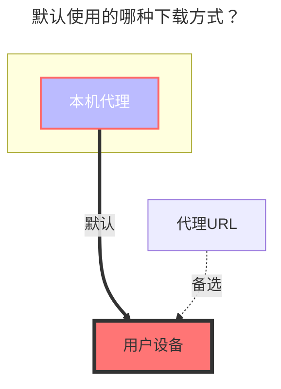
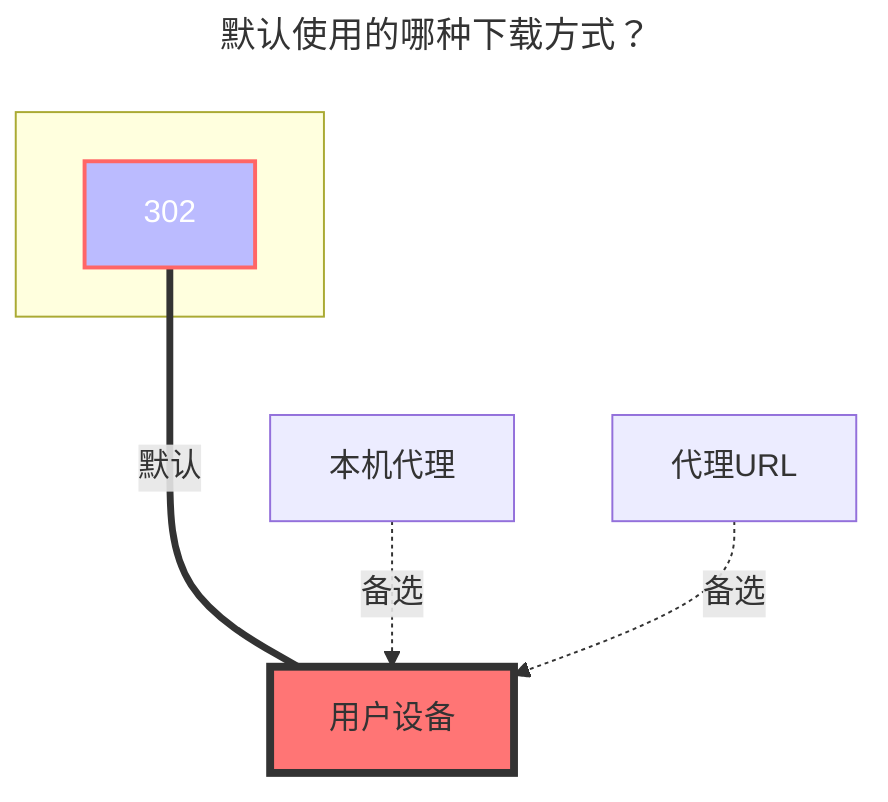

---
# This is the icon of the page
icon: iconfont icon-state
# This control sidebar order
order: 18
# A page can have multiple categories
category:
  - Guide
# A page can have multiple tags
tag:
  - Storage
  - Guide
  - "本地代理"
  - "302"
# this page is sticky in article list
sticky: true
# this page will appear in starred articles
star: true
---

# UC / TV

## **UC 网盘**

**https://drive.uc.cn/**

 

### **Cookie**

在 `F12`任意请求中找到携带 `Cookie` 的值

 

### **根文件夹ID**

根目录ID为 `0`

- 子文件夹ID进入文件夹后顶部地址栏获取目录ID，如果子目录越深目录ID在地址栏越靠后，想挂载哪个子目录就写那个子目录ID就可以

 

### **默认使用的下载方式**

## **UC TV**

TV 版支持 `302`，但是只能 `访问` 和 `下载` 两个操作，其它操作不支持(接口不支持)

 

### **添加方式**

1. 选择 `UCTV` 驱动，填写挂载路径，然后保存
2. 返回全部驱动页面，使用手机APP扫描二维码（如果不显示二维码，驱动右上角点击点击`表格布局` 从列表模式切换成表格模式）
3. 扫码确认后，禁用驱动，再启用`驱动`即可使用
   - `Refresh token 刷新令牌`、`Device id 设备ID `、`Query token` 会自动填充，不需要人工填写
     - 请不要进行编辑手动修改

 

### **根文件夹ID**

要挂载的根文件夹，默认为`0`

- 子文件夹ID进入文件夹后顶部地址栏获取目录ID，如果子目录越深目录ID在地址栏越靠后

 

### **默认使用的下载方式**

