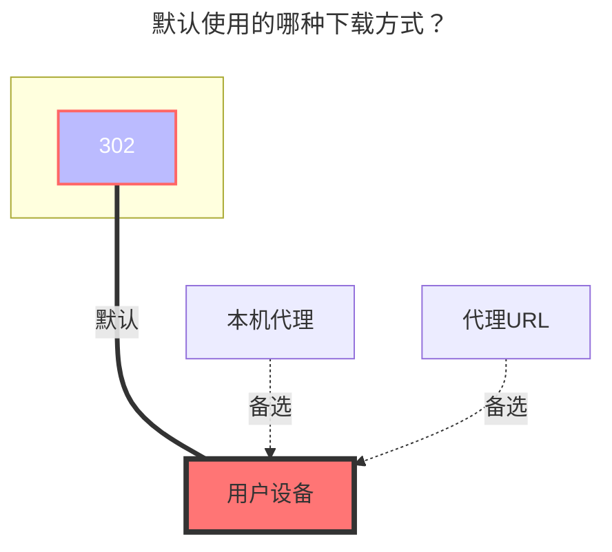

---
# This is the icon of the page
icon: iconfont icon-state
# This control sidebar order
order: 22
# A page can have multiple categories
category:
  - Guide
# A page can have multiple tags
tag:
  - Storage
  - Guide
  - "302"
# this page is sticky in article list
sticky: true
# this page will appear in starred articles
star: true
---

# 又拍云存储

UPYUN 存储服务，简称 USS，[**又拍云USS官网**](https://console.upyun.com/services/file/)

## **存储桶**

**UPYUN 存储桶服务名称**

## **Endpoint**

加速域名（默认的测试域名或已绑定域名，不是CNAME域名）

如果使用http协议，请自行添加`http://`协议头

又拍云提供的默认测试域名在部分网络环境下无法访问，且不支持https，建议使用自行绑定的域名

## **操作员名称**

操作员名称

## **操作员密码**

操作员密码

## **根文件夹 ID**

根路径，不填则默认为根目录。

## **签名链接有效期**

签名下载地址的有效期默认为 4 小时。

## **详情填写示意图**

::: tip

如果你要用官方提供的的测试域名那必须要手动加http  例如： http://xxx.test.upcdn.net

如果想用HTTPS，当然也可以添加自己的域名就可以使用例如：https://you.xxx.com

操作员的权限自己需要哪个开启哪个，读取权限必须得开！

:::

### **默认使用的下载方式**

