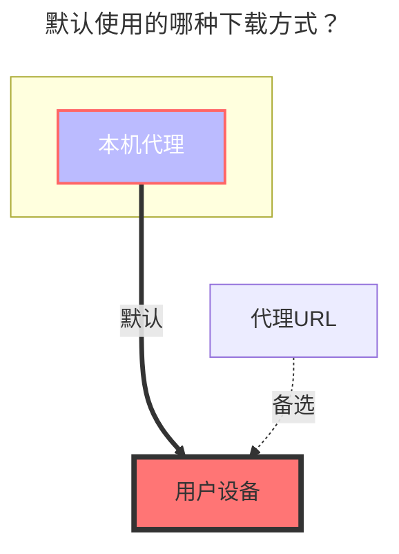

---
# This is the icon of the page
icon: iconfont icon-state
# This control sidebar order
order: 19
# A page can have multiple categories
category:
  - Guide
# A page can have multiple tags
tag:
  - Storage
  - Guide
  - "本地代理"
# this page is sticky in article list
sticky: true
# this page will appear in starred articles
star: true
---

# 腾讯智能创作平台

腾讯智能创作平台官网链接：**https://app.v.tencent.com**

 

### **Cookie**

随意在F12请求中找到一个携带Cookie的参数复制就可以

- 建议使用靠后刷新出来的请求中的Cookie参数，会携带含有 **`tf_x`** 参数的Cookie
- `login`、`DescribeTasks`、`DescribeAccount`、`DescribeUserProfile`、`DescribePlatformSettings`、`CreateBindWechatQRCode`

可以使用的Cookie是需要携带含有 **`tf_x`** 参数的Cookie，下图示例中左侧的可以使用，右侧的无法使用。

 

### **根文件夹ID**

根目录ID为：`9`，如果想单独挂载其它子文件夹，参考阿里云盘的方式

- 如果填写好后还是不显示，请手动右下角按钮进行刷新

 

### **Tf uid**

不需要填写，存储填写正确Cookie保存后会自动填写 `Tf uid`

 

### **默认使用的下载方式**

