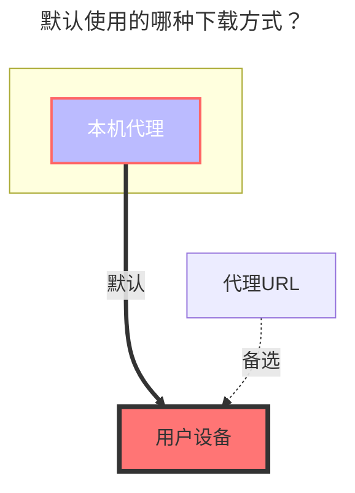

---
# This is the icon of the page
icon: iconfont icon-state
# This control sidebar order
order: 35
# A page can have multiple categories
category:
  - Guide
# A page can have multiple tags
tag:
  - Storage
  - Guide
  - "本地代理"
# this page is sticky in article list
sticky: true
# this page will appear in starred articles
star: true
---

# WebDAV

## **地址**

WebDAV 根地址

## **用户名**

用户名

## **密码**

密码

## **根文件夹ID**

要挂载的文件夹路径，与加入地址相同

## **OneDrive/SharePoint**

选择 vendor 为 sharepoint，支持国际版/世纪互联。

你可以通过[这个工具](https://alist.nn.ci/tool/onedrive/webdav.html)获取 WebdAV 根地址，如果要挂载指定的目录，在后面拼接即可。

用户名为 OneDrive 账号邮箱，密码即为 OneDrive 账号密码。

## 错误提示

- 提示 **failed get objs: failed to list objs: PROPFIND/根目录：403** 错误

需登陆 [Entra ID](https://entra.microsoft.com/#view/Microsoft_AAD_IAM/TenantOverview.ReactView?Microsoft_AAD_IAM_legacyAADRedirect=true) 找到 `管理安全默认值` 点击并禁用（❗注：此项关闭后会关闭域的 Authenticator 验证）

### **默认使用的下载方式**

