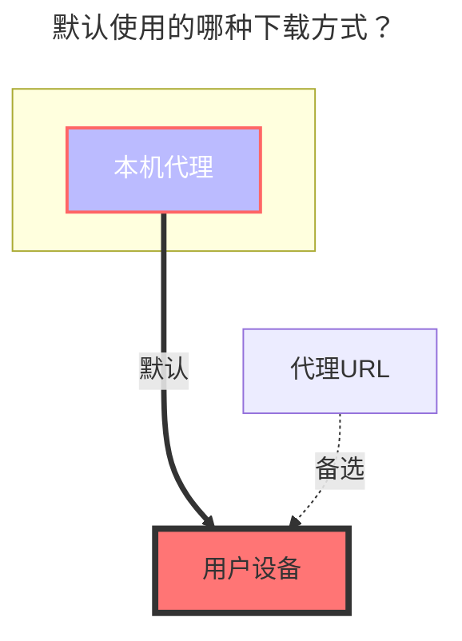

---
# This is the icon of the page
icon: iconfont icon-state
# This control sidebar order
order: 9
# A page can have multiple categories
category:
  - Guide
# A page can have multiple tags
tag:
  - Storage
  - Guide
  - "本地代理"
# this page is sticky in article list
sticky: true
# this page will appear in starred articles
star: true
---

# 腾讯微云

腾讯微云官网：**https://www.weiyun.com**

::: tip 微云登录有效期提示

- QQ：登录目前只能保活48小时就得更换cookie
- 微信：无此问题，用的是token

推荐使用微信登录

:::

## **根文件夹ID**

1. 展示根目录，**`留空`** 就可以不用填写，程序会自动填充

2. 如果只展示其中单个文件夹ID，进入想展示的文件夹內然后复制顶部地址栏后面的ID

## **Cookie**

登录微云后，**打开开发者调试工具(F12)**，在任意请求中找到携带cookie的请求复制填写就可以。

- 微信登录获取的token比QQ登录的cookie字段要长
- QQ微信都是填写这个`Cookie`字段值，随意找一个请求就能看到

## **其他说明**

1. 复制功能不用
2. **建议不要将微云对外共享，毕竟是绑定的自己QQ号码，如果被封/冻结之后对QQ或者其它产生了重大损失后果自负**

### **默认使用的下载方式**

