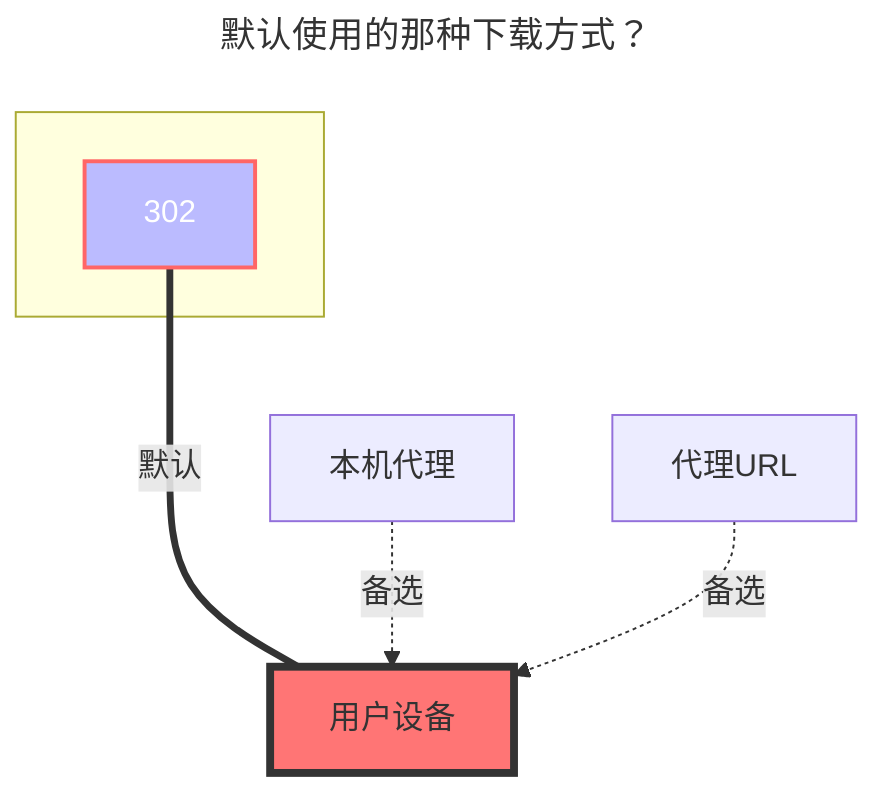

---
# This is the icon of the page
icon: state
# This control sidebar order
order: 7
# A page can have multiple categories
category:
  - Guide
# A page can have multiple tags
tag:
  - Storage
  - Guide
# this page is sticky in article list
sticky: true
# this page will appear in starred articles
star: true
---

# 中国联通云盘

云盘地址：**https://pan.wo.cn/**

- :warning: AList 3.19.0版本及以上版本才能使用本驱动

::: tip
挂载联通云盘使用的是Web端，如果你先使用工具获取了令牌再去登录网页端会将AList挂载的挤掉

反之如果先登录Web端，再登录挂载，会将Web端挤掉

登录手机端没问题，不会被挤掉。

:::

获取令牌工具地址：**https://alist.nn.ci/tool/wopan/token.html**

- 

## **根文件夹ID**

- 个人云：**0**
  - 单独文件夹ID：未知(后续补充)

- 家庭云：未知(后续补充)
  - 家庭云单独文件夹ID：未知(后续补充)

## **类型**

个人云：将`Family ID`空着就是个人云

家庭云：填写`Family ID` 未知(后续补充)

### **AList挂载填写示例：**

将使用工具获取的 `refresh_token填入刷新令牌`，`access_token填入访问令牌`

### **默认使用的下载方式**

