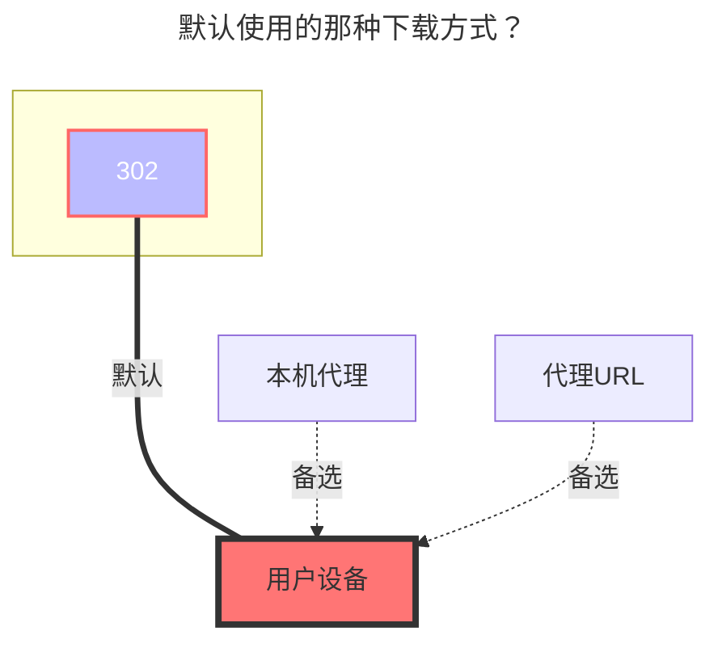

---
# This is the icon of the page
icon: state
# This control sidebar order
order: 36
# A page can have multiple categories
category:
  - Guide
# A page can have multiple tags
tag:
  - Storage
  - Guide
# this page is sticky in article list
sticky: true
# this page will appear in starred articles
star: true
---

# Yandex云盘

### **刷新令牌**
[点击这里](https://oauth.yandex.com/authorize?response_type=code&client_id=a78d5a69054042fa936f6c77f9a0ae8b) 来获取刷新令牌。

### **根文件夹路径**
要挂载的根文件夹，默认为 `/`

### **默认使用的下载方式**

